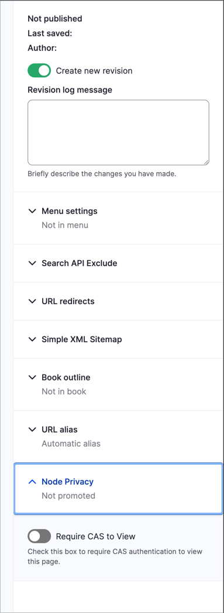

# CAS Private Page

This module provides a method for editors to make pages private without accessing the admin config pages for CAS forced login. It puts a control widget into the node meta-data sidebar.

There is a dependency on the base CAS module.